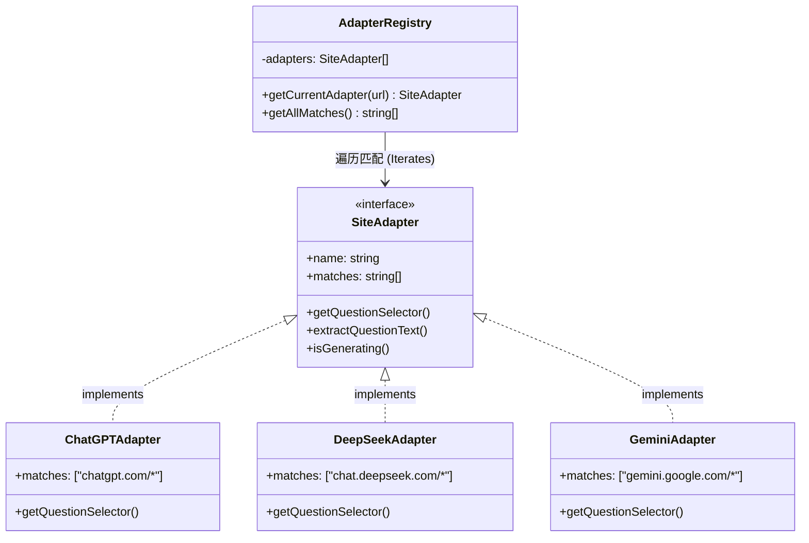

前段时间写的浏览器扩展 [Megi](https://megi.dev/zh)，最近在少数派和应用商店都收获了很多好评。目前 Chrome 和 Edge 的用户加起来已有 2000+，还被收录进了少数派近期推荐的 7 款浏览器扩展。

Megi 起源于去年十一月份的一个想法，具体可以看我之前的[这篇博客](https://shenn.xyz/posts/megi)。

## 设计灵感

名字来源于我正在使用的 VS Code 主题 moegi。图标也提取自这个主题的配色：

import { Cards, Card } from 'fumadocs-ui/components/card';

<Cards>
  <Card
    title={
      
        
        #ED9CC2
      
    }
  >
    **纷杂的线性结构**。代表未经处理的、线性的网页原始对话流。
  </Card>

  <Card
    title={
      
        
        #377961
      
    }
  >
    **有序的思考树**。代表经用户整理后，结构清晰的侧边栏知识树。
  </Card>
</Cards>

## 系统设计

代码层面主要使用了适配器模式。这样做的好处是，每当我要添加一个新的 AI 站点支持时，代码都是独立的，互不影响，维护和扩展都非常方便。

## 一些想法

用户的增长和好评，确实给我带来了不小的成就感，也让我确信了一个简单的产品逻辑：产品不需要面面俱到，只要能精准解决一个核心痛点，自然会收获用户的认可。

回看 Megi 的核心功能——「侧边栏问题导航」，它的初衷是解决“长上下文对话混乱”的问题。虽然在发布后，我也发现了一些功能相似的竞品，但这让我明白：有的时候不一定要做第一个解决问题的人。只要能比别人更用心打磨细节，一样能赢得用户。