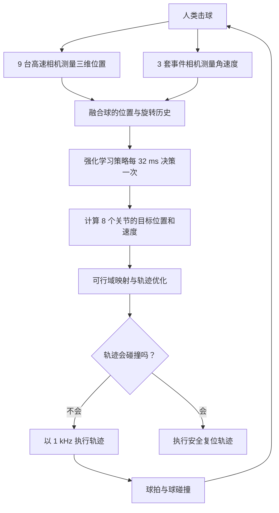

## Dev

+ [PocketJS](https://github.com/pocket-stack/pocketjs)

PocketJS 是一个在浏览器之外运行的高性能组件 UI 框架——它可以在真实的 Sony PSP 和 PS Vita 硬件、模拟器、通过 WASM 运行的浏览器环境、通过 wgpu 运行的原生桌面窗口，以及 Bun 的无头环境中运行。

只需编写 Solid JSX、Vue Vapor JSX 或 Vue 单文件组件，PocketJS 便会将布局、样式、文本和动画移入一个微型的 no_std Rust 核心中，从而实现在 8 MB 内存预算下提供 60 FPS 的动画效果。没有 DOM，没有运行时 CSS 引擎，也没有浏览器——只有一个由 JavaScript 响应式驱动的保留模式原生 UI 树。

## 文章

+ [Outplaying elite table tennis players with an autonomous robot](https://www.nature.com/articles/s41586-026-10338-5)

### ACE 机器人的回球流程

### 两个物理问题

<Accordions>

<Accordion title="一个旋转乒乓球的完整运动状态，至少需要描述哪些物理量？">

完整运动状态至少需要描述球的位置、线速度和角速度：

$$
\mathbf p=(x,y,z),\qquad
\mathbf v=(v_x,v_y,v_z),\qquad
\boldsymbol\omega=(\omega_x,\omega_y,\omega_z)
$$

- $\mathbf p$：位置
- $\mathbf v$：线速度
- $\boldsymbol\omega$：角速度，也就是旋转轴与旋转强度

</Accordion>

<Accordion title="对向前飞行的上旋球，马格努斯力通常指向哪里？它会使轨迹发生什么变化？">

马格努斯力与球的线速度和角速度的叉乘相关：

$$
\mathbf f_M \propto -\mathbf v \times \boldsymbol\omega
$$

对于向前飞行的上旋球，马格努斯力通常指向下方，与重力 $\mathbf f_g$ 叠加后，会让球的轨迹更快下沉。

这会带来两个主要影响：

- **轨迹下沉**：上旋球在空中的下降速度更快，飞行轨迹更加弯曲，也会比预期更早落台。
- **进攻空间更大**：球员可以用更高的初速度击球，同时依靠上旋产生的下压力让球落在对方台面内。

可以把上旋带来的马格努斯力理解为一种“隐形的下压力”：它让球在高速前冲的同时快速扎向球台，从而增加回球的威力和难度。

</Accordion>

</Accordions>
